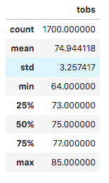
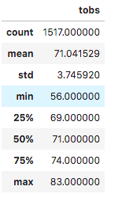

# Surfs Up

## Overview of the Analysis
The purpose of this analysis was to help W. Avy with his business idea of combining a surf shop with an ice cream shop. Using data of the weather in Hawaii, we were able to find out if a business like this is substainable year round. With our research, we were able to come up with some conclusions. 

## Results
* We queried weather statistics for June and December to see if the weather will be substainable for the ice cream and surf shop year round. Here are the stats. June on the left, December on the right.

   
 
* The average temperature in December is only 3.9 degrees colder than it is in June. This is a good sign for W. Avy's business being year round. 

* The coldest it gets in December is 8 degrees colder than it is in June. For most places, this stat would never be this close for minimum weather in June and December. Hawaii may be one of the few places in the world where this shop can be successful year round.

## Summary

*  I would almost guarentee the summer months will generate the most revenue. But that is the case for most businesses in a vacation destination like Hawaii.
*  I believe that this idea for a surf and ice cream shop will be able to be a year round business. If W. Avy can make this shop a staple in the island, there is a chance this type of shop can really take off. The idea is great for a place like Hawaii.
* Another query I think we should have run would be to query the weather for every month and make sure the weather is consistent year round. This data will help prepare for which months will be the most busy.
* A final query that we should have ran would be to look at the precipitation for each month. This is an important stat to consider. With too much rain, the business may run into some problems.  